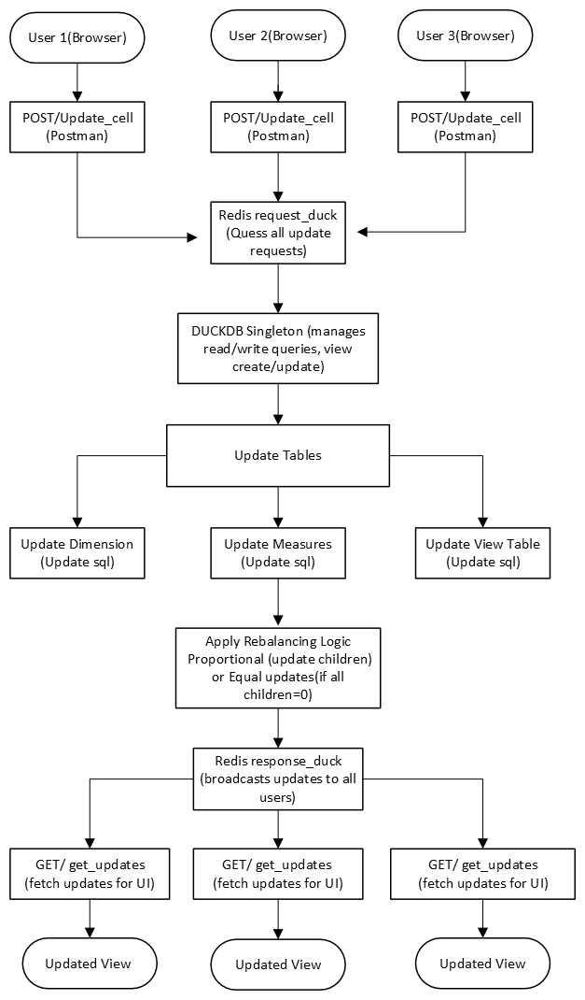

**Design Document for Real-Time Shared Spreadsheet Backend**

**Table of Contents**

1\. Introduction

\- 1.1 Purpose and Scope

\- 1.2 Audience

\- 1.3 Sources of Information

2\. Current Process Overview

\- 2.1 Current Challenges

\- 2.2 Objective of the Proposed System

3\. Application Integration Requirements

\- 3.1 Components in Scope

\- 3.2 Supporting Components

4\. Solution Architecture

\- 4.1 Architectural Diagram

\- 4.2 Data Flow for Update Process

\- 4.3 Rebalancing Logic

\- 4.4 Modules and Their Responsibilities

5\. Information Security

\- 5.1 API Authentication

\- 5.2 Redis Security

\- 5.3 Data Integrity in DuckDB

6\. Technology Stack

\- 6.1 Software Components

7\. Application Capacity Planning

\- 7.1 Scalability

\- 7.2 High-Availability Planning

8\. Dependencies

9\. Assumptions

10\. Test cases

**1. Introduction**

**1.1 Purpose and Scope**

The purpose of this document is to design and implement a backend
architecture for a shared spreadsheet engine that supports real-time
multi-user updates. The backend uses DuckDB for storage, Redis for
messaging, and FastAPI for API communication.

**1.2 Audience**

This document is intended for:

\- Liquid Analytics team

**1.3 Sources of Information**

\- Project requirements shared in the challenge document.

\- Design patterns for Redis and DuckDB integrations.

\- API best practices and real-time update systems.

**2. Current Process Overview**

**2.1 Current Challenges**

\- Lack of a backend that supports real-time updates.

\- Inconsistent data aggregation in hierarchical structures.

\- Difficulty in synchronizing updates across users.

**2.2 Objective of the Proposed System**

\- Enable multi-user collaboration on a shared spreadsheet.

\- Maintain consistent parent-child relationships using rebalancing
logic.

\- Provide APIs for CRUD operations and real-time synchronization.

**3. Application Integration Requirements**

**3.1 Components in Scope**

  -----------------------------------------------------------------------
  **Component**           **Integration Method**  **Description**
  ----------------------- ----------------------- -----------------------
  Fast API                Rest APIs               APIs for User
                                                  interactions

  Redis                   Streams                 Handle msg
                                                  queuing/updates

  DuckDB                  SQL Queries             Stores/processes data
  -----------------------------------------------------------------------

**3.2 Supporting Components**

  -----------------------------------------------------------------------
  **Component**           **Integration Method**  **Description**
  ----------------------- ----------------------- -----------------------
  Postman                 Rest API testing        Tests APIs for
                                                  functionality

  Python                  Library Support         Implements logic for
                                                  Redis/DuckDB
  -----------------------------------------------------------------------

**4. Solution Architecture**

**4.1 Architectural Diagram**

Below is the architecture flowchart for the project:

The flowchart illustrates the interactions between users, APIs, Redis, DuckDB, and other components.

**4.2 Data Flow for Update Process**

**1. User Action:**

\- User sends a \`POST /update_cell\` request with details of the cell
to be updated.

**2. Redis Stream:**

\- The request is queued in the \`request_duck\` stream.

**3. DuckDB Processing:**

\- Singleton Manager fetches the request, updates DuckDB, and
recalculates affected views.

**4. Rebalancing:**

\- Runs logic for proportional distribution or equal distribution.

**5. Redis Broadcast:**

\- Updated data is pushed to \`response_duck\` stream.

**6. User Notification:**

\- Users fetch updates via \`GET /get_updates\`.

**4.3 Rebalancing Logic**

\- Proportional Distribution:

\- Adjust child values proportionally to match parent totals.

\- Equal Distribution:

\- Assigns equal values to children if all current values are zero.

**- SQL Example:**

WITH updated_children AS (

SELECT child_id, value \* (new_parent_value / SUM(value)) AS new_value

FROM children

WHERE parent_id = X

)

UPDATE children

SET value = new_value

WHERE child_id IN (SELECT child_id FROM updated_children);

**4.4 Modules and Their Responsibilities**

  -----------------------------------------------------------------------
  **Module**                          **Responsibility**
  ----------------------------------- -----------------------------------
  FastAPI                             Exposes REST APIs for CRUD
                                      operations.

  Redis Streams                       Handles real-time message queuing.

  DuckDB Singleton                    Executes SQL queries, manages
                                      updates.

  Rebalancing Module                  Ensures data consistency in
                                      hierarchies.
  -----------------------------------------------------------------------

**5. Information Security**

**5.1 API Authentication**

\- Use API keys or OAuth tokens for securing endpoints.

**5.2 Redis Security**

\- Use password protection and SSL for Redis communication.

**5.3 Data Integrity in DuckDB**

\- Transactions ensure atomicity during updates.

**6. Technology Stack**

**6.1 Software Components**

\- Programming Language: Python

\- API Framework: FastAPI

\- Database: DuckDB

\- Message Queue: Redis

**7. Application Capacity Planning**

**7.1 Scalability**

\- Redis cluster for handling high volumes of messages.

\- Read-only replicas of DuckDB for load balancing.

**7.2 High-Availability Planning**

\- Backup Redis streams and DuckDB snapshots.

**8. Dependencies**

\- Redis server for messaging.

\- DuckDB for SQL processing.

\- Python libraries: \`fastapi\`, \`redis\`, \`duckdb\`.

**9. Assumptions**

\- Users interact with the backend via APIs or a frontend (to be
developed later).

\- Redis and DuckDB are hosted on the same server for low-latency
communication.

\- Proper indexing is implemented in DuckDB for query optimization.

**10. Test cases**

1.  Update a cell and validate the corresponding changes in DuckDB and
    Redis.

2.  Simulate multiple users sending updates simultaneously and validate
    that Redis and DuckDB handle updates sequentially.

3.  Update a parent node (Brand X) and verify proportional updates to
    child nodes.

4.  Update a parent node with zeroed child nodes and verify equal
    distribution.

5.  Update the sales table and ensure sales_summary_by_product_family
    view is consistent

6.  Update a non existent table/cell
